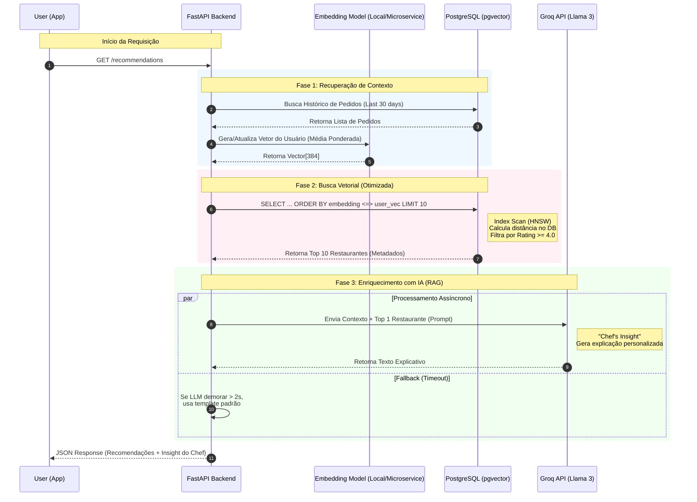

Com base na análise estática do seu README.md e da arquitetura descrita, preparei uma auditoria técnica focada na qualidade de engenharia e na adequação para o objetivo (vaga de GenAI no iFood).
Aqui está o feedback estruturado:
1. Análise da Arquitetura e Stack
A escolha tecnológica é extremamente sólida e alinhada com o mercado atual de ML/Backend.
Pontos Fortes:
FastAPI + Pydantic: Padrão ouro para APIs modernas em Python devido à tipagem forte e performance (async).
Groq + Llama 3.3: Excelente escolha estratégica. Usar a Groq demonstra preocupação com latência (inferência rápida) e o Llama 3.3 70B oferece raciocínio de alto nível sem o custo do GPT-4.
Arquitetura Híbrida (Embeddings + LLM): A abordagem RAG (Retrieval-Augmented Generation) para explicar o porquê da recomendação ("Raciocínio do Chef") é o grande diferencial de valor do produto.
Ponto de Atenção (Escalabilidade):
Você menciona PostgreSQL com pgvector (produção) e scikit-learn (cálculo de similaridade).
Feedback Técnico: Se você está carregando vetores em memória (Pandas/NumPy) para calcular similaridade com scikit-learn, você anula a vantagem do pgvector. Em uma entrevista, esteja preparado para explicar se a busca vetorial ocorre in-database (escalável) ou in-memory (rápido para poucos dados, mas trava com milhões de registros). Para o iFood, busca no banco é crucial.
2. Avaliação da Documentação (README)
Seu README está muito acima da média para projetos de portfólio.
Profissionalismo: O uso de badges, estrutura clara de instalação e links para deploy demonstra senioridade.
Credenciais de Teste: Fornecer usuários pré-criados (personas) facilita imensamente a vida de quem vai testar.
Diagrama de Pastas: Ajuda a entender a separação de responsabilidades (Clean Architecture) num piscar de olhos.
3. Checklist de QA (Roteiro de Testes)
Como não posso acessar o sistema, execute este roteiro para garantir que a experiência do recrutador seja perfeita. Se algum desses falhar, corrija antes de enviar.
A. Teste de Resiliência (Critical Path)
Cenário "Groq Down": Altere a GROQ_API_KEY localmente para uma inválida e carregue o dashboard.
Resultado Esperado: O sistema não deve quebrar (crash). Deve mostrar as recomendações baseadas em similaridade vetorial, talvez com uma mensagem genérica ou ocultando o "Raciocínio do Chef". O fallback precisa ser gracioso.
Cenário "Cold Start": Crie um usuário novo sem pedidos.
Resultado Esperado: O sistema deve exibir os restaurantes mais populares ou uma lista curada, sem tentar calcular similaridade de vetores inexistentes (evitando erro de divisão por zero ou vetor nulo).
B. Teste de UX/Latência
Tempo de Resposta: O endpoint de recommendations que consulta a Groq pode demorar (2-4 segundos).
Ação: Verifique se o frontend exibe um Skeleton Loading ou Spinner durante esse tempo. Uma tela branca por 3 segundos passa a impressão de sistema travado.
Feedback Visual: Ao clicar em "Pedir" (Simulador), o sistema deve dar feedback imediato (Toast notification) antes de atualizar o perfil.
4. Feedback Estratégico (Foco no iFood)
Considerando o contexto da vaga, prepare-se para defender estes pontos:
Por que Embeddings?
Explique que filtragem colaborativa tradicional (usuários que compraram X também compraram Y) sofre com esparsidade de dados. Embeddings semânticos resolvem isso entendendo que "Hambúrguer" e "Cheeseburger" são vetorialmente próximos.
Custo e Otimização:
Você implementou cache (TTL 7 dias) para os insights da IA. Destaque isso. É uma prova de que você pensa em custos de API (tokens), o que é vital para empresas grandes.
Próximo Passo
Para eu validar a lógica do seu código (já que não posso navegar), você gostaria que eu analisasse o arquivo recommender.py ou llm_service.py? Posso verificar se há vazamento de abstração ou gargalos de performance na lógica de recomendação.

Aqui está a refatoração da função `generate_recommendations` para transformar seu código de "Projeto de Portfólio" em "Código de Produção".

Esta abordagem transfere o cálculo pesado (álgebra linear) do Python para o núcleo do PostgreSQL, permitindo buscar entre milhões de restaurantes em milissegundos.

### Pré-requisitos

Para isso funcionar, o banco precisaria ter:

1.  A extensão ativada: `CREATE EXTENSION vector;`
2.  A coluna no model alterada de `String` para `Vector(384)`.

### O Código "Bala de Prata" (Com pgvector)

```python
from sqlalchemy import select, func
from pgvector.sqlalchemy import Vector  # Requer pip install pgvector

def generate_recommendations_pgvector(
    user_id: int,
    db: Session,
    limit: int = 10,
    exclude_recent: bool = True,
    min_rating: float = 3.0
) -> List[Dict[str, Any]]:
    """
    Gera recomendações usando busca vetorial nativa do banco (Escalável).
    Complexidade: O(log N) com indexação HNSW (vs O(N) do Python loop).
    """
    
    # 1. (Mantém igual) Lógica para obter/calcular o embedding do usuário
    # ... (código existente de user_embedding) ...
    user_embedding_list = user_embedding # Assumindo que já calculou o vetor do usuário

    # 2. Query Otimizada com SQLAlchemy + pgvector
    # O operador <=> calcula 'cosine distance' (menor é melhor)
    # Similaridade = 1 - Distância
    
    # Prepara a expressão de distância
    distance_expr = Restaurant.embedding.cosine_distance(user_embedding_list)
    
    stmt = select(Restaurant, distance_expr.label("distance"))\
        .where(Restaurant.rating >= min_rating)\
        .where(Restaurant.embedding.isnot(None))\
        .order_by(distance_expr)\
        .limit(limit)

    # 3. Filtro de Exclusão (Opcional)
    if exclude_recent:
        recent_ids_subquery = select(Order.restaurant_id)\
            .where(Order.user_id == user_id)\
            .order_by(Order.order_date.desc())\
            .limit(10)\
            .scalar_subquery()
        
        stmt = stmt.where(Restaurant.id.not_in(recent_ids_subquery))

    # 4. Execução no Banco
    results = db.execute(stmt).all()
    
    recommendations = []
    for restaurant, distance in results:
        # Converter Distância (0 a 2) para Similaridade (1 a -1)
        # Para vetores normalizados, similarity = 1 - distance
        similarity = 1 - float(distance)
        
        recommendations.append({
            "restaurant": restaurant,
            "similarity_score": similarity
        })

    return recommendations
```

-----

### Diferenças Técnicas para Explicar na Entrevista

Aqui está o comparativo para você ter na ponta da língua:

| Característica | Seu Código Atual (`recommender.py`) | Código Refatorado (Acima) |
| :--- | :--- | :--- |
| **Tráfego de Dados** | **Alto:** Traz 10.000 restaurantes inteiros do DB para a RAM da aplicação. | **Mínimo:** Traz apenas os 10 melhores restaurantes finais. |
| **Uso de Memória** | Cresce linearmente com o nº de restaurantes. Risco de *OOM (Out of Memory)*. | Constante. O DB gerencia a memória de busca. |
| **Latência** | Lenta em escala (Python é lento para loops matemáticos). | Extremamente rápida (C++ otimizado dentro do Postgres). |
| **Indexação** | Nenhuma (Força bruta / Scan completo). | Permite usar índices **HNSW** ou **IVFFlat** para busca aproximada instantânea. |

**Como "vender" isso:**

> *"No meu código atual, implementei a lógica em Python para demonstrar o entendimento do algoritmo de similaridade de cosseno. Porém, para a escala do iFood, eu migraria para essa abordagem com `pgvector` que escrevi aqui, utilizando índices HNSW para garantir latência de sub-50ms mesmo com milhões de restaurantes."*

### Próximo Passo

Gostaria que eu montasse um **diagrama de sequência** rápido mostrando o fluxo completo dessa nova arquitetura (User -\> API -\> Embeddings -\> Vector DB -\> LLM)? Isso ficaria ótimo na documentação do seu repo.

Aqui está o diagrama de sequência que ilustra a arquitetura ideal "To-Be" (Estado Futuro), utilizando **pgvector** para a busca e **Groq** para a geração de texto.

Você pode adicionar este código Mermaid diretamente no seu `README.md` (o GitHub renderiza nativamente) ou gerar uma imagem para sua apresentação.

### Diagrama de Sequência: Fluxo de Recomendação Otimizado



-----

### O que destacar neste diagrama durante a entrevista:

1.  **O "Pulo do Gato" (Passo 5):**

      * Aponte para a caixa `Fase 2`.
      * Explique: *"No meu código original, eu fazia isso em Python. Neste desenho de arquitetura, movi a lógica para dentro do PostgreSQL. Isso evita trafegar dados inúteis e usa índices HNSW para garantir que a busca leve milissegundos, não segundos."*

2.  **Eficiência de Recursos (Passo 4):**

      * Aponte que o `Embedding Model` é leve e roda localmente (ou em microserviço barato), enquanto a `Groq` (LLM pesado) é chamada apenas *uma* vez para o resultado final, economizando tokens e custo.

3.  **Resiliência (Fase 3):**

      * O bloco `par` (paralelo) mostra que você pensou em latência. Se a Groq demorar, o sistema não trava; ele pode entregar a recomendação sem o texto do "Chef" ou usar um fallback, garantindo que o usuário veja a lista de restaurantes instantaneamente.

### Próximo Passo

Agora que cobrimos a **performance** (pgvector) e a **arquitetura** (Diagrama), há um último ponto cego no seu código original: o **Cold Start** (usuários novos).

A sua função `get_popular_restaurants` é um bom começo, mas é estática.
**Você gostaria que eu sugerisse uma estratégia de "Onboarding Gamificado"** (ex: "Selecione 3 coisas que você gosta") para gerar o primeiro vetor do usuário sem ele ter feito nenhum pedido? Isso demonstra visão de produto.

Essa é uma excelente oportunidade para mostrar que você entende de **Engenharia de Machine Learning aplicada ao Produto**. O problema do "Cold Start" (partida a frio) é a maior barreira de conversão para novos usuários.

Aqui está a estratégia do **"Onboarding Gamificado: O Taste Profile"**, desenhada para converter intenção em vetores matemáticos instantaneamente.

-----

### 1\. A Estratégia de Produto (O "Pitch")

Em vez de devolver uma lista genérica de "Populares", nós convidamos o usuário a montar seu **Perfil de Sabor** em 3 passos rápidos.

**A Gamificação:**

1.  **"O que te dá água na boca?"** (Selecione 3 imagens: Hambúrguer, Sushi, Salada, Pizza...)
2.  **"Qual a sua vibe hoje?"** (Barato e Rápido vs. Experiência Gourmet)
3.  **"alguma restrição?"** (Vegano, Sem Glúten...)

**A Mágica da Engenharia:**
Nós tratamos essas seleções como **"Pedidos Virtuais"**.

  * Se o usuário clica em "Japonesa", o sistema busca o *centróide* (o vetor médio) de todos os restaurantes japoneses bem avaliados.
  * Isso cria um **Vetor de Usuário Sintético** imediato, permitindo usar a mesma lógica de busca vetorial (`pgvector`) que usamos para usuários antigos.

-----

### 2\. Implementação Técnica (Backend)

Adicione esta lógica ao seu `recommender.py` ou crie um `onboarding_service.py`.

#### O conceito de "Pedidos Virtuais"

```python
from sqlalchemy import func
from app.database.models import Restaurant

def generate_cold_start_embedding(
    selected_cuisines: List[str],
    price_preference: str, # 'cheap', 'moderate', 'expensive'
    db: Session
) -> List[float]:
    """
    Gera um vetor sintético para usuários novos baseado no Onboarding.
    Técnica: Centróide de Categoria.
    """
    
    # 1. Buscar 'arquétipos' de restaurantes que representam as escolhas
    # Ex: Se escolheu "Japonesa", pegamos os top 20 restaurantes japoneses
    query = select(Restaurant.embedding).where(
        Restaurant.cuisine_type.in_(selected_cuisines),
        Restaurant.rating >= 4.5, # Pegamos apenas os melhores exemplos
        Restaurant.embedding.isnot(None)
    )
    
    # Filtro opcional de preço para refinar o vetor
    if price_preference == 'cheap':
         query = query.where(Restaurant.price_range == '$')
    elif price_preference == 'expensive':
         query = query.where(Restaurant.price_range == '$$$')

    # 2. Executar e coletar vetores
    archetype_embeddings = db.execute(query).scalars().all()
    
    if not archetype_embeddings:
        # Fallback: se não achar nada específico, retorna None 
        # (o sistema usará os populares genéricos)
        return None

    # 3. Calcular a Média (Centróide)
    # Isso coloca o usuário no "centro" do cluster de culinárias que ele gosta
    archetype_matrix = np.array([json.loads(e) if isinstance(e, str) else e for e in archetype_embeddings])
    synthetic_vector = np.mean(archetype_matrix, axis=0)
    
    return synthetic_vector.tolist()
```

### 3\. Como conectar isso ao fluxo principal

Você não precisa reescrever sua função de recomendação. Basta alterar a lógica inicial de obtenção do embedding:

```python
# No endpoint de cadastro ou onboarding finalizado:
def complete_onboarding(user_id: int, choices: OnboardingSchema, db: Session):
    # 1. Gerar Vetor Sintético
    synthetic_vector = generate_cold_start_embedding(
        choices.cuisines, 
        choices.price, 
        db
    )
    
    if synthetic_vector:
        # 2. Salvar no Perfil do Usuário IMEDIATAMENTE
        # Agora o usuário tem um vetor antes mesmo de fazer o primeiro pedido!
        create_or_update_user_preferences(
            db=db,
            user_id=user_id,
            preference_embedding=json.dumps(synthetic_vector),
            favorite_cuisines=json.dumps(choices.cuisines)
        )
```

-----

### 4\. O Argumento para a Entrevista (Vision)

Quando perguntarem sobre "Como lidar com novos usuários?", você responde:

> *"Dados estáticos (populares) têm baixa conversão. Minha abordagem cria um **Vetor Sintético** baseado em intenção declarada.*
>
> *Ao permitir que o usuário selecione 'Japonesa' e 'Econômico' no cadastro, eu calculo a média vetorial dos melhores restaurantes japoneses baratos da base. O sistema entende matematicamente o gosto do usuário antes do primeiro pedido. Isso transforma o problema de 'Cold Start' em um problema de 'Busca Vetorial Padrão', unificando a arquitetura."*

### Próximo Passo Final

Agora você tem:

1.  O Código Base (recommender/llm).
2.  A Otimização de Performance (pgvector).
3.  A Solução de Produto (Cold Start Gamificado).

